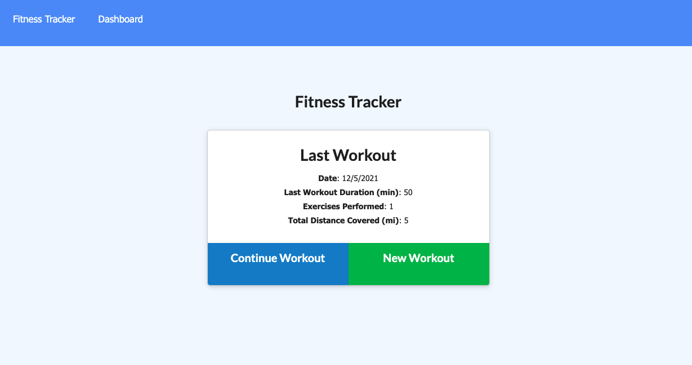
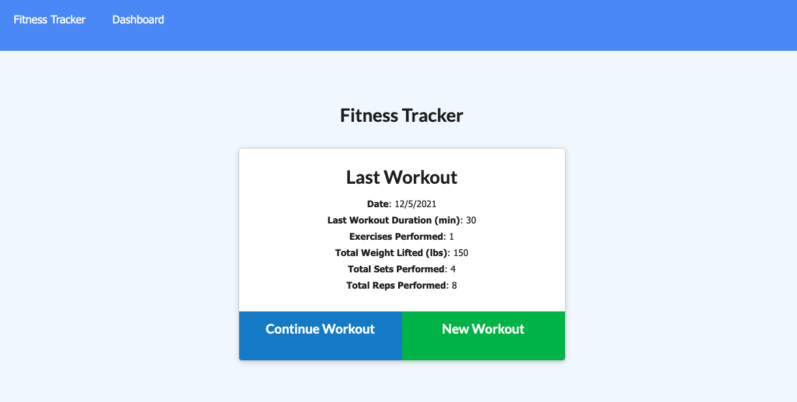
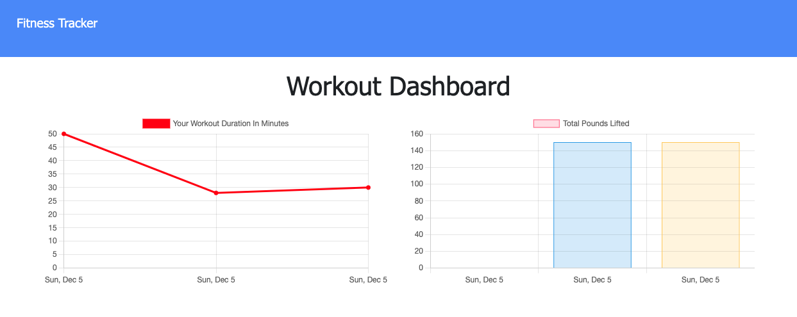
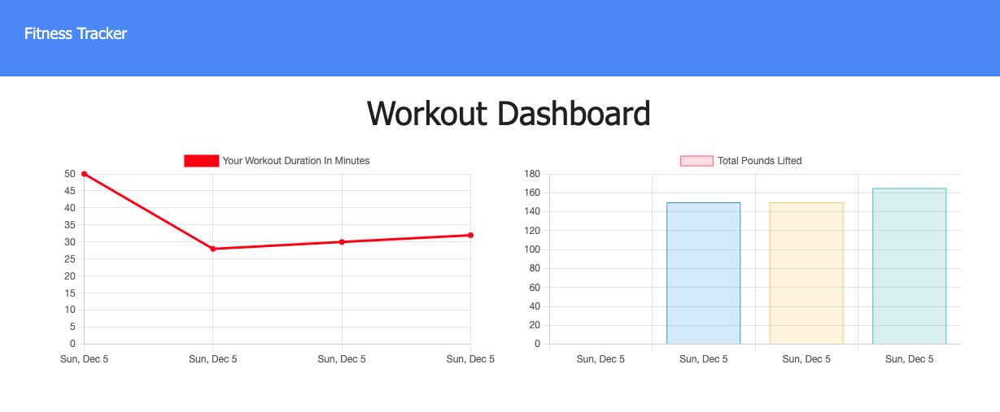

# Workout Tracker (Bootcamp Assignment 18 - NoSQL)

By: Sadie Sial

___


#### Table of Contents

* [Description](#description)
* [Technologies](#technologies)
* [Screenshots](#screenshots)
* [Links](#links)
* [Contact](#contact)
* [License](#license)
<br><br>

## Description <br>

[This is a web application](https://workout-tracker-sns.herokuapp.com/?id=61ad1a7e7d7f9100163ba2c8) that allows users to track their workouts and view their progress. Users can track either resistance or cardio workouts. Resistance workouts will record name, type, weight, sets, reps, and duration of each exercise. Cardio workouts will additionally record the distance of each exercise. Their input will be displayed visually within the custom Dashboard. Total workout duration is represented in a line chart while resistance weights will be totaled in a bar chart. Start your fittness goals today!


### User Story:

```
As a user, I want to be able to view create and track daily workouts. I want to be able to log multiple exercises in a workout on a given day. I should also be able to track the name, type, weight, sets, reps, and duration of exercise. If the exercise is a cardio exercise, I should be able to track my distance traveled.
```

```
Users are able to:

  * Add exercises to the most recent workout plan.

  * Add new exercises to a new workout plan.

  * View the combined weight of multiple exercises from the past seven workouts on the `stats` page.

  * View the total duration of each workout from the past seven workouts on the `stats` page.
```


## Technologies

The technologies used to create this program were: 
- HTML + CSS
- Javascript
- NodeJS
- ExpressJS
- MongoDB
- Mongo Atlas
- Heroku

<br>

## Screenshots
```
Last Workout Display
```


```
Updated Display
```


```
Workout Dashboard
```


```
Updated Workout Dashboard
```


<br>

## Links

- [Deployed App on Heroku](https://workout-tracker-sns.herokuapp.com/?id=61ad1a7e7d7f9100163ba2c8)

- [Google Drive](https://drive.google.com/drive/folders/1Q73SY0TiaKR0SS1sHMcOjcV2U-SoDEEh?usp=sharing)

- [GitHub Repository](https://github.com/sadielinks/employee-tracker-sql)

<br>

## Contact

- [GitHub Profile](https://github.com/sadielinks)
- [Portfolio](https://sadielinks.github.io/professional-portfolio/)
- [Email](mailto:sadiecodes@gmail.com)

<br>

## License

This source code is available to everyone under the standard [MIT license ©](https://choosealicense.com/licenses/mit/) <br><br>
© 2021 Trilogy Education Services, LLC, a 2U, Inc. brand. Confidential and Proprietary. All Rights Reserved.